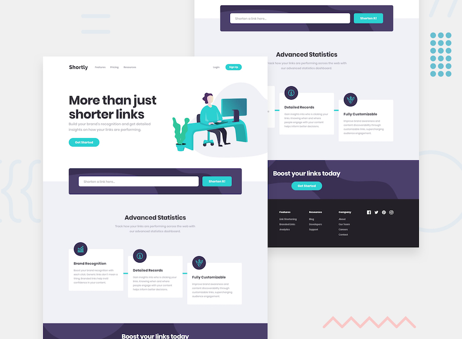

  

    <!--  -->
    
    <!--  -->
    <h1 align="center">Shortly - URL shortening API solution</h1>
  

  <!--  -->
  

     
    <a href="#">View Demo</a>
    ·
    <a href="#" target="_blank">Report Bug</a>
    ·
    <a href="#" target="_blank">Request Feature</a>
  

  <!--  -->
  

    <!-- Profile -->
    
    <!-- Status -->
    
    <!--  -->
    <!--  -->
  

   

This is a solution to the [Shortly URL shortening API Challenge challenge on Frontend Mentor](https://www.frontendmentor.io/challenges/url-shortening-api-landing-page-2ce3ob-G).

## Table of contents

- [Overview](#overview)
  - [The challenge](#the-challenge)
  - [Links](#links)
- [My process](#my-process)
  - [Built with](#built-with)
  - [Useful resources](#useful-resources)
- [Author](#author)
- [Acknowledgments](#acknowledgments)

## Overview

### The challenge

Users should be able to:

- View the optimal layout for the site depending on their device's screen size
- Shorten any valid URL
- See a list of their shortened links, even after refreshing the browser
- Copy the shortened link to their clipboard in a single click
- Receive an error message when the `form` is submitted if:
  - The `input` field is empty

### Links

- Solution URL: [Shortly - URL shortening API landing page [SCSS + Vanillajs]](https://www.frontendmentor.io/solutions/shortly-url-shortening-api-landing-page-scss-vanillajs-c7dXfR7VpN)
- Live Site URL: [shortly](https://femc-shortly.netlify.app/)

## My process

### Built with

 &nbsp; &nbsp;  &nbsp;

- [uiballs](https://uiball.com/ldrs/)
- [validatorjs](https://github.com/validatorjs/validator.js)
- [tinyurl](https://discord.com/channels/824970620529279006/1175398414805119026/1175401636483567676)

### Useful resources

- [Clipboard: writeText() method](https://developer.mozilla.org/en-US/docs/Web/API/Clipboard/writeText)

## Author

- Frontend Mentor - [@xyzeez](https://www.frontendmentor.io/profile/xyzeez)
- Twitter - [@xyzeez\_](https://twitter.com/xyzeez_)

## Acknowledgments

- Challenge was provided by [Frontend Mentor](https://www.frontendmentor.io), a platform that helps improve coding skills by building realistic projects.
